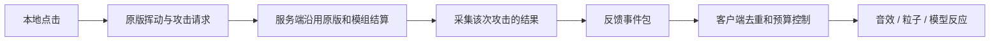

# Minecraft 近战反馈与 GTNH 移植研究

日期：2026-09-18。范围：Java Edition 1.7.10，对照 1.9 新增反馈与 1.21.1 的代表性实现；不把 Bedrock、Combat Test 或所有后续版本混在一起。本文件为研究结论与候选方案，没有修改游戏实现或运行配置，也没有完成游戏内 A/B 实验。

**结论：优先移植与实际命中同步的声音和视觉信息，保留 1.7.10 的伤害、无敌帧、暴击及击退规则。** 高版本没有为所有怪物引入一套通用的受击后仰、硬直或 hit-stop 系统。新增的攻击音效分类、伤害粒子、横扫表现，以及反馈之间更清楚的关联，可以解释相当一部分体感差异；各项贡献大小是待验证的体验假设。

**一、证据范围与可靠性**

- 直接阅读本工作区 Forge 1.7.10 反编译源码，包括 `EntityLivingBase`、`EntityPlayer`、`RendererLivingEntity`、`NetHandlerPlayClient`、`ItemRenderer`。
- 直接读取本机开发缓存中的 Minecraft 1.21.1 / NeoForge patched sources，对照 `Player.attack`、`LivingEntity.hurt/knockback`、`LivingEntityRenderer`、`ItemInHandRenderer`。涉及 NeoForge 的扩展钩子与原版逻辑分开处理；没有把 NeoForge 新事件名称当作 1.7.10 API。
- 从 Mojang 版本清单获取 1.7.10、1.9 的资源索引和 `sounds.json`，确认攻击声音事件的真实差异。
- 实时读取并固定 GTNH 整合包上游提交 `f6bbb5da082928472a4f20b8f1dd96c115889d6e`，以及 EFR 上游提交 `65407a439b57fba00e9a0b7d9f5abc564b53743c`。这两份上游快照不等于用户实际安装的整合包版本，也不保证是同一发行版所配套的组合。
- 未测量响度、帧时间、网络延迟或主观评分。因此“更有重量”“更易读”属于基于机制的解释，不是实测因果效应。

**二、新旧版本真正不同的地方**

| 维度 | 1.7.10 已有内容 | 高版本的变化或需要纠正的印象 | 移植判断 |
|---|---|---|---|
| 怪物受伤变红 | `hurtTime` 驱动红色覆盖 | 现代实现仍有 hurt/death overlay；不是 1.9 首创 | 先保留；额外闪光只做可关闭的表现层 |
| 身体和肢体运动 | 扣血流程设置 `limbSwingAmount = 1.5`，再叠加真实击退 | 1.21.1 仍设置步行动画速度；没有统一新增的定向躯干后仰 | 新增后仰属于原创增强，不应称为原版回移植 |
| 暴击、附魔粒子 | 已有 `crit` 和 `magicCrit`，网络动画类型 4/5 | 不是现代版新增；差异可能来自其余效果的叠加 | 保留和去重，不能每击伪装成暴击 |
| 攻击声音 | 受害者叫声、通用受伤声音 | 1.9 有 crit、knockback、nodamage、strong、sweep、weak 六类玩家攻击事件 | 高收益；攻击动作和受害者叫声可同时表达不同信息 |
| 伤害粒子 | 无现代伤害爱心反馈 | 现代 `DAMAGE_INDICATOR` 给扣血一个空间化信号 | 高收益；数量和强度必须有上限 |
| 横扫 | 无原版剑横扫范围伤害 | 现代横扫同时含范围伤害、击退、声音、白色弧形粒子 | 不能把整套规则算成纯视觉升级 |
| 竖直击退 | 基础击退在空中仍处理 Y 速度 | 现代基础实现仅落地时增加 Y 速度，空中保留原 Y 速度 | 影响浮空追击，默认不移植 |
| 击退抗性 | 基础击退以概率被完全抵消 | 现代实现按抗性缩放强度 | 可提高一致性，但会改变机制 |
| 自己受击的镜头 | 有 hurt camera；方向同步有历史问题 | 1.19.4 官方更新恢复按来袭方向倾斜并提供强度选项 | 与“打中怪物”分开配置 |
| 第一人称挥动 | 已有连续插值和正弦轨迹 | 现代代码也保留相近的基础挥动公式 | 不能笼统宣称现代版换成全新物理挥砍 |

声音的主要价值是分类与时序：普通攻击、暴击、冲刺击退、无伤害接触不再只依靠怪物叫声区分。粒子则把一次生命值变化显示在目标所在位置。横扫同时让多个实体发生响应，是另一种明显的视觉放大，但它具有实质性的范围伤害规则。

观察到的“怪物一震”可能包含瞬间位移、四肢摆动、变红及粒子共同作用。不能据此推断怪物 AI 暂停、攻击计时被重置，或新增了通用硬直系统。若参考视频含 Fresh Animations、其他动画模组、资源包或光影，必须另行对照。

现代代表实现的伤害粒子也不是每次点击都会生成：`Player.attack` 在攻击成功后计算目标生命值差，差值大于 2 HP 时按约一粒/2 HP 生成。这不能当作包含吸收心等一切损失的精确伤害计量器。

**三、保留旧版连击需要冻结哪些机制**

“没有攻击冷却”不等于“每次鼠标点击都重新造成全额伤害”。1.7.10 默认 `maxHurtResistantTime = 20`，但过滤等量或更小伤害的条件是剩余时间大于其一半。因此常规同伤害攻击的过滤窗口约 10 tick，即 20 TPS 下约 0.5 秒；窗口内更高伤害通常只补差值。模组武器和实体可以改变这些规则。

`hurtTime = 10` 是受伤表现计时，`hurtResistantTime` 是伤害处理计时，两者不能混用。对窗口内补差值的攻击，原版也不一定重新触发完整的受伤动画和基础击退。仅用“目标是否变红”判断本次是否命中，会漏掉这类情况。

应保持：攻击输入、伤害公式、无敌帧、旧版允许的暴击条件、疾跑击退及疾跑取消行为、剑格挡、攻击距离、匠魂和 GT 工具的既有规则。新增表现应使用独立计时器，不通过重置上述字段制造反馈。

基础击退可概括为（省略抗性判定和特殊实体）：

```text
1.7.10:
  水平速度 = 原水平速度 / 2 - 归一化来袭方向 × 0.4
  Y速度 = min(原Y速度 / 2 + 0.4, 0.4)

现代代表实现:
  strength = 基础强度 × (1 - 击退抗性)
  水平速度 = 原水平速度 / 2 - 归一化来袭方向 × strength
  地面: Y速度 = min(原Y速度 / 2 + strength, 0.4)
  空中: Y速度保持原值
```

这是速度冲量，不是最终移动的方块数。摩擦、碰撞、AI、地面和网络同步还会影响可见轨迹。旧版 `EntityPlayer` 的疾跑/附魔附加击退又走 `addVelocity`；现代对生物常走 `knockback`，所以不能只移植一个方法就声称完整一致。

官方 20w06a 宣布抗性改为比例，但后续仍有残余概率问题，22w03a 才列出玩家击退抗性仍受随机影响的修复。讨论成熟的比例抗性应注明版本，而不是把 1.16 公告当作所有路径立即完全一致的证据。

**四、GTNH 已有功能：最先检查这里**

上游配置快照中：

```properties
# config/etfuturum/sounds.cfg 的 player 分类
B:combatSounds=true
S:combatSoundStrongThreshold=4.0

# config/etfuturum/world.cfg 的 client 分类
B:enableDmgIndicator=false

# config/etfuturum/functions.cfg
B:enableAttackedAtYawFix=true
```

因此第一轮实验应该开启已有爱心粒子并保留已启用的声音，比较收益，而不是再安装一个重复播放全部音效的模组。实际文件需要按玩家安装版本核对。

注意 `enableDmgIndicator` 虽归类为 client，所核查 EFR 实现同时在服务器决定是否发送粒子包、客户端决定是否显示：多人游戏只改客户端可能无效；应检查两端，单机则是本地整合服务器。

EFR 将无冷却环境的“强攻击”映射为伤害阈值（默认 4 HP），不是恢复现代攻击蓄力规则。其 `LivingHurtEvent` 实现在最终伤害完成前产生战斗音效和粒子，且粒子用事件数值再估算减伤，不是读取最终生命值差。因此护甲、吸收心、后续事件取消或自定义伤害处理都需要验证。源码检查揭示的是准确性边界，不代表这些情况已在用户整合包中复现。

**五、可行路线比较**

| 路线 | 工作内容 | 收益 | 限制 |
|---|---|---|---|
| A：配置现有 EFR | 核对声音、开启爱心粒子，检查资源和音量设置 | 最快验证已有现代反馈 | 沿用 EFR 的触发与估算方式 |
| B：仅客户端增强 | 根据已有受伤状态/暴击包添加轻微模型反应和有限粒子 | 不要求服务器加新模块 | 无法可靠获知每次伤害的攻击者、最终伤害和被拒绝原因 |
| C：两端安装反馈模块 | 服务端采集实际伤害结果，客户端统一呈现 | 归因准确、可区分吸收/扣血、适合扩展 | 需要协议、去重、GTNH 模组适配 |

推荐先 A 做参照，再以 C 为正式目标；B 可作为能力不足时的降级模式。没有服务端支持时，应降低反馈精度，避免猜测“自己的每次挥动都造成了伤害”。

**六、适合 LegacyVisualFix 的候选实现**

当前工程已经有 Mixin、独立配置、客户端渲染模块与 SimpleNetworkWrapper 通信模式，可新增独立 `combat` 功能模块。现有主 Mixin 配置主要注册客户端条目；权威采集需要独立、可在专用服务器加载的公共入口，不能把服务端逻辑放进 client 列表。



1. **事件采集**：`AttackEntityEvent` 只能说明尝试攻击；`LivingHurtEvent` 不能视为最终扣血。1.7.10 也不能直接使用现代 Forge/NeoForge 的 `LivingDamageEvent` 或现代击退事件。候选钩子应围绕实际伤害调用采集调用前后的生命值、吸收值、返回结果和攻击上下文；对虚拟护盾、重写伤害流程的实体/武器提供适配器。不要用整个 tick 的血量差归因，避免把火焰、荆棘或第二个玩家的伤害算进来。
2. **结果分类**：分离攻击被接受、生命值损失、吸收损失、伤害被拒绝、暴击/附魔标志、疾跑附加击退。`attackEntityFrom` 返回 true 也不能单独保证最终扣血大于零。旧版可能疾跑暴击同时成立，分类应允许多标志。
3. **网络内容**：世界/维度、攻击者和目标标识、事件序号、伤害类别、已确认的数值/标志，以及足够生成视觉效果的位置或方向。击中位置若来自 AABB/瞄准近似，应标记为估算，不能声称原版提供了精确刀刃接触点。服务器不信任客户端上报的伤害或成功标志。
4. **客户端呈现**：输入发生立即保留原版挥动；命中专属强音效、粒子和模型脉冲等服务端确认后一起播放。对比已有 S19 受伤状态、S0B 暴击动画和 EFR 反馈，建立明确的归属/去重策略。不可叠加播放同一类命中音效。
5. **线程和协议**：网络处理把渲染状态变更放进客户端主线程；使用握手声明双方能力，仅向支持者发送。保持现有允许无本模组服务器连接的能力时，自动退回有限客户端模式。多段伤害应保留子事件，并按上限合并呈现，不能按“同 tick 同目标”粗暴吞掉有效结果。
6. **适配边界**：原版武器 → GT 工具 → 匠魂武器和多段伤害 → 特殊怪物、Boss、多部件实体逐类核验。实体继承、自定义护盾、攻击源分类都可能绕过统一钩子；不承诺只注入 `EntityPlayer` 就覆盖全部 GTNH 战斗。

建议首版优先级：

| 优先级 | 表现 | 约束 |
|---|---|---|
| P0 | 可靠命中确认、普通/暴击/无伤害声音、短命中粒子 | 保留伤害和位移；与 EFR 去重 |
| P1 | 小幅定向躯干反应、轻微武器回弹、可选血条损失轨迹 | 只改变渲染状态，不改变实体位置、碰撞箱或 AI |
| P2 | 自定义材质音色、有限击杀强调 | 用适配表处理金属/骨骼等分类，不能当作现代原版已有机制 |
| 独立实验 | 比例击退抗性、击退轨迹调整 | 明确属于玩法修改，不纳入默认“保留连击”模式 |

可用于原型的初始范围（均为设计建议，不是原版测得参数）：每次确认命中 4–8 个局部粒子、120–220 ms 生命周期；模型后仰约 2–4°、100–160 ms 内恢复；以缓出且有幅度上限的脉冲叠加。伤害越大不应线性生成越多粒子，避免 GTNH 高伤武器引起粒子洪水。保留原有红色覆盖，新模型脉冲用独立计时器。

默认不增加相机震动、不冻结世界或输入、不延迟挥动、不制造假的长距离目标位移。强 hit-stop 与长回弹会破坏连续输入和网络同步。白色横扫弧若没有对应范围判定，容易造成命中范围误解；单体攻击更适合局部短弧或碰撞闪点。

**七、验证办法与验收边界**

在相同武器、怪物、距离、难度、TPS、资源包和音量下，逐组比较：原配置 → EFR 粒子开启 → 可靠事件音画 → 仅加模型反应。再单独测试任何物理击退实验，避免把玩法变化误认为纯表现收益。

必要场景：普通怪、护甲怪、满抗性目标、空中连击、疾跑暴击、击退附魔、吸收心、完全免伤、取消伤害事件、火焰持续伤害、同 tick 多人攻击、匠魂多段攻击、GT 工具及多部件 Boss。专用服务器还要测试有/无反馈模块客户端、低 TPS 和延迟。

验收标准：

- 开关视觉增强前后，相同输入的生命值、吸收量、真实速度、位置、无敌帧和攻击次数保持一致。
- 被取消/拒绝的攻击不显示“造成伤害”的粒子；吸收心消耗有单独语义。
- 一次成功事件不重复播放两套同类反馈，多人伤害不误归因。
- 模型反应不改变 hitbox，不污染下一实体的 OpenGL 状态；检查 Angelica 开/关光影、护甲、附魔层、隐身实体。
- 测量帧时间、粒子峰值、声音叠加量和网络事件数量；反馈强度提高不应以明显卡顿为代价。
- 主观评价分开记录“能否分清命中”“能否看清目标”“是否有力量感”“连击是否顺手”，不要只问是否更炫。

**八、可复核的来源**

- [Mojang 1.9 版本元数据](https://piston-meta.mojang.com/v1/packages/9178828493e41a24452841039710f05728c466d6/1.9.json)；[1.9 声音定义](https://resources.download.minecraft.net/97/97accfa8d1505c3c2de436883c58efff7266fdc5)；[1.7.10 声音定义](https://resources.download.minecraft.net/fc/fce0bb3e14ade7b292a7c1d5fa785533d8106d82)。资源内容通过 HTTP 直接读取确认。
- [20w06a 官方公告：击退抗性比例化](https://www.minecraft.net/it-it/article/minecraft-snapshot-20w06a)；[22w03a 官方公告：MC-185545 修复](https://www.minecraft.net/en-us/article/minecraft-snapshot-22w03a)。
- [1.19.4 官方公告：受伤方向与 Damage Tilt](https://www.minecraft.net/en-us/article/minecraft-java-edition-1-19-4)。
- [GTNH world.cfg，固定提交](https://github.com/GTNewHorizons/GT-New-Horizons-Modpack/blob/f6bbb5da082928472a4f20b8f1dd96c115889d6e/config/etfuturum/world.cfg#L47)；[sounds.cfg](https://github.com/GTNewHorizons/GT-New-Horizons-Modpack/blob/f6bbb5da082928472a4f20b8f1dd96c115889d6e/config/etfuturum/sounds.cfg#L158)；[functions.cfg](https://github.com/GTNewHorizons/GT-New-Horizons-Modpack/blob/f6bbb5da082928472a4f20b8f1dd96c115889d6e/config/etfuturum/functions.cfg#L11)。
- [EFR 伤害事件实现，固定提交](https://github.com/GTNewHorizons/Et-Futurum-Requiem/blob/65407a439b57fba00e9a0b7d9f5abc564b53743c/src/main/java/ganymedes01/etfuturum/core/handlers/ServerEventHandler.java#L1751)；[粒子客户端开关](https://github.com/GTNewHorizons/Et-Futurum-Requiem/blob/65407a439b57fba00e9a0b7d9f5abc564b53743c/src/main/java/ganymedes01/etfuturum/network/BlackHeartParticlesHandler.java#L22)；[声音阈值定义](https://github.com/GTNewHorizons/Et-Futurum-Requiem/blob/65407a439b57fba00e9a0b7d9f5abc564b53743c/src/main/java/ganymedes01/etfuturum/configuration/configs/ConfigSounds.java#L128)。

本地代码锚点（工作区根目录下）：

- `build/rfg/minecraft-src/java/net/minecraft/entity/EntityLivingBase.java`：820 攻击入口、854 无敌帧、1050 基础击退、1257 减伤处理、1348 受伤状态处理。
- `build/rfg/minecraft-src/java/net/minecraft/entity/player/EntityPlayer.java`：1337 玩家攻击、1392 附加击退。
- `build/rfg/minecraft-src/java/net/minecraft/client/renderer/entity/RendererLivingEntity.java`：236 红色覆盖、339 模型旋转。
- `build/rfg/minecraft-src/java/net/minecraft/client/network/NetHandlerPlayClient.java`：803 动画包、960 实体状态包。
- 本次只读采集材料保存在 `build/combat-research/`；其中 `modern-1.21.1/` 是上述本机 NeoForge 开发缓存的源码节选，不能冒充未打补丁的原版源码发行。
