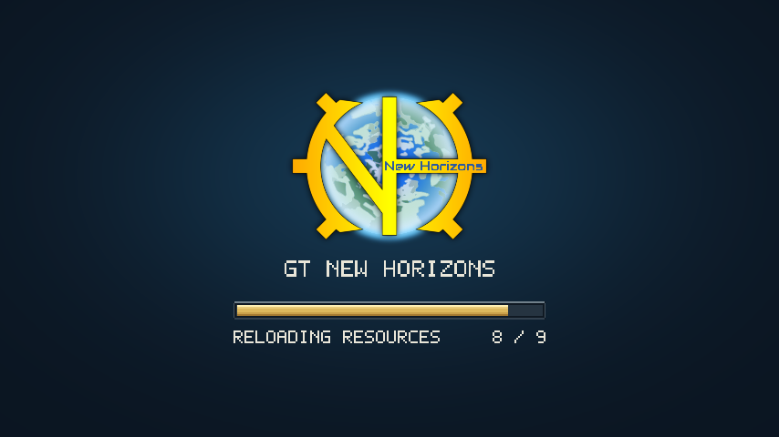

# 资源重载界面

切换语言、资源包、F3+T 和 Angelica 光影重载时显示可定制的进度界面。



## 主题定制

编辑游戏目录下 `config/legacyvisualfix/theme.properties`，然后按 F3+T：

```properties
enabled=true
showText=true
showDetails=false
animation.fadeInMs=400
animation.fadeOutMs=600
showLogo=true
title=GT NEW HORIZONS
texture.logo=file:logo.png
logo.x=0.5
logo.y=0.38
logo.height=0.37
title.y=0.62
texture.background=file:background.png
texture.track=file:bar_track.png
texture.fill=file:bar_fill.png
background.fit=cover
bar.x=0.5
bar.y=0.71
bar.widthFraction=0.4
bar.height=6
color.background=FF101E2C
color.track=FFFFFFFF
color.fill=FFFFFFFF
color.text=FFE9E6D9
```

对应 PNG 放在 `config/legacyvisualfix/` 下。也可使用 `legacyvisualfix:textures/gui/background.png` 这样的资源位置，由资源包覆盖；背景或进度条设为空字符串则绘制纯色，Logo 为空则隐藏。进度条纹理缺失且色值为默认白色时，使用深灰轨道与金色填充。

| 配置 | 含义 |
| --- | --- |
| `enabled` / `showText` | 开关加载界面 / 阶段文字 |
| `texture.background` | 背景 PNG |
| `animation.fadeInMs` / `animation.fadeOutMs` | 淡入 / 淡出毫秒数，默认 400 / 600；0 关闭，最大 2000 |
| `texture.logo` / `showLogo` | 独立 Logo PNG / 显示开关；空路径或缺失图片时隐藏 |
| `logo.x` / `logo.y` / `logo.height` | Logo 中心坐标及高度占屏幕的比例，保持原图宽高比 |
| `title` / `title.y` | 标题和垂直位置；标题留空时隐藏，最多 128 字符 |
| `showDetails` | 是否额外显示技术阶段文字，默认关闭 |
| `bar.widthFraction` | 进度条占屏幕宽度比例；设为 0 后使用 `bar.width` 固定 GUI 像素 |
| `texture.track` / `texture.fill` | 进度条底图 / 填充 PNG |
| `background.fit` | `cover` 裁切铺满、`contain` 完整显示、`stretch` 拉伸 |
| `bar.x` / `bar.y` | 进度条中心占屏幕宽高的比例，范围 0–1 |
| `bar.width` / `bar.height` | GUI 缩放后的像素尺寸；界面较小时自动收缩并限制在屏幕内 |
| `color.*` | `RRGGBB` 或 `AARRGGBB`，可带 `#`；材质颜色会乘以配置颜色 |

填充通过裁切材质右侧表示进度，保持剩余部分的 UV 比例。默认使用 6 GUI 像素高的扁平色条，无倒角和立体边框。用 `FFFFFFFF` 保留原材质颜色。PNG 单边最多 4096 像素，总计最多 4,194,304 像素。无效图片回退纯色，无效字段使用默认值。

0.1 和 0.2 的完整未修改默认配置自动升级，并备份为对应的 `theme-0.1.properties.bak` 或 `theme-0.2.properties.bak`。修改过任意配置项的文件保持原样；旧 `bar.width` 继续有效。想切换为新版主题，可先备份自己的配置，再复制下方示例。配置文件按 Java Properties 读取；非 Latin-1 文字使用 `\uXXXX` 转义。标题和状态采用独立像素字体，其他字符使用系统字体回退。

完整默认配置见 [examples/gtnh/theme.properties](../examples/gtnh/theme.properties)。资源包示例目录：

```text
YourTheme/
  pack.mcmeta
  assets/legacyvisualfix/textures/gui/
    background.png
    logo.png
    bar_track.png
    bar_fill.png
```

`pack.mcmeta`：

```json
{"pack":{"pack_format":1,"description":"LegacyVisualFix theme"}}
```

加载期间使用独立纹理快照。切换资源包时，本次加载仍显示旧主题；新资源包主题在成功重载后缓存，从下一次加载开始显示。本地配置和图片在下一次重载开始前读取。坏资源包失败期间保留上一次缓存。

## 进度含义与限制

资源重载进度是**已完成监听器数 / 总监听器数**。光影重载显示准备与清理、读取光影包、应用管线三个阶段；独立管线编译显示一个工作阶段。它们都不是剩余时间或编译文件数量。纹理文字显示 Forge 当前处理的项，未将“开始处理”当作“处理完成”。游戏仍同步执行重载；在监听器、纹理加载、mipmap 和上传的可用边界刷新，单个第三方长步骤仍可能暂停画面。

光影接入已验证 **Angelica 2.1.25**，为可选功能；没有 Angelica 时自动跳过，不增加硬依赖。关闭光影后的普通固定功能管线不会触发光影加载界面。其他光影加载器（如 OptiFine/ShadersMod）尚未接入。淡入对切换前的已显示画面进行约 400ms 的同步混合；淡出在后续正常游戏帧上完成，不增加 600ms 的重载阻塞。

纹理细分 Mixin 对替换过原版纹理方法的渲染模组采用可选注入；监听器阶段进度仍保留。尚未穷尽所有整合包、显卡、着色器与全屏组合。准确测试记录和重现命令见 [docs/testing.md](testing.md)。
