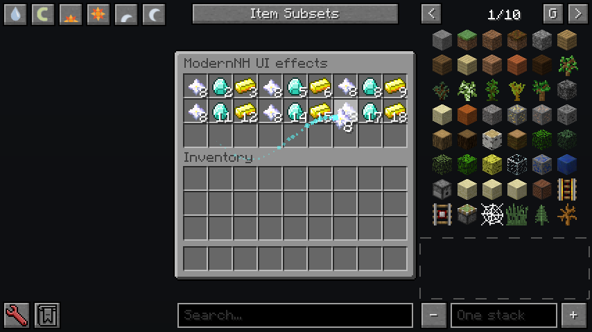

# 物品 UI 动效（ModernNH 0.7.0）

五项客户端效果：快捷栏选中框平滑移动；悬停物品缩放；鼠标携带物品缩放与阻尼倾斜；相同物品浮动；非普通稀有度物品的彩色粒子拖尾。



按 Immersive UI 的公开行为独立实现，没有复制其代码、粒子贴图或引入 OctoLib/ShatterLib。拖尾使用程序绘制的小菱形。此模块无需服务端安装，不增加数据包、不改槽位坐标、物品数据或点击逻辑。ModernNH 其他功能的安装要求见 README。

## 配置

首次启动生成 `config/modernnh/ui.cfg`，修改后重启。独立于背包入场动画的 `inventory.cfg` 和加载界面主题。

| 字段（effects 分类） | 默认值 | 行为 |
| --- | --- | --- |
| enabled | true | 总开关 |
| hotbar | true | 平滑选中框，实际选中物品立即改变 |
| hover | true | 悬停真实槽位图标缩放 |
| carried | true | 携带图标缩放与倾斜 |
| matching | true | 与携带物品相同的槽位图标上下浮动 |
| trails | true | 非普通稀有度携带物品拖尾 |
| hoverScale / carriedScale | 1.2 / 1.2 | 倍率，范围 1–1.6 |
| rotationDegrees | 18 | 目标最大倾角，范围 0–25 度；弹簧有轻微回弹，总角度限制 25 度 |
| floatAmplitude | 0.65 | 浮动幅度，范围 0–2 GUI 像素 |
| responseSpeed | 18 | 快捷栏、悬停的响应速度，范围 1–40 |
| maxParticles | 128 | 粒子数量上限，范围 0–512；0 禁止发射 |
| particleRate | 60 | 移动时每秒发射上限，范围 0–120 |
| excludedScreens | 空列表 | 禁用指定完整 GUI 类名，精确匹配，不支持通配符 |

匹配比较 Item、metadata/damage 与 NBT，忽略数量。不同电路参数、工具 NBT 和材料 metadata 不会因注册名相同而一起浮动。手持不同类型物品时，槽位不执行悬停放大。

拖尾使用物品真正的 `getRarity()` 及其颜色，不依据 GT 电压等级或名称颜色推断。1.7.10 的普通下界之星虽然闪光，仍属于 common，因此不自动产生拖尾；带附魔的稀有物品可以触发。粒子按移动距离和时间发射，停止移动后消失，长停顿不会补发旧路径。

## 接入范围

| 界面/组件 | 实现范围 | 边界 |
| --- | --- | --- |
| Forge 快捷栏 | 原有纹理选中框平滑移动 | 完全替换 HOTBAR 绘制的第三方 HUD 不保证生效 |
| 原版生存/创造物品栏、箱子、继承原版绘制的容器 | 悬停、携带、同类浮动、拖尾 | 继承关系本身不能保证兼容完全重写的 drawScreen |
| NEI | 容器真实槽位绘制委托保留；嵌套适配去重；遮挡槽位的 NEI 控件不触发悬停放大 | 物品目录、书签和配方展示图标不新增动画 |
| ModularUI 1 | SlotWidget 与 ModularGui 的独立鼠标物品绘制 | 幽灵槽、流体槽不加入物品效果 |
| ModularUI 2 | ItemSlot 与 ClientScreenHandler 的独立容器/鼠标物品绘制 | 幽灵槽、流体槽不加入物品效果；不是依赖被其取消的原版 drawScreen |
| GT 机器 | 使用上述受支持 MUI 绘制入口的物品组件可以获得效果 | 不能由框架测试推断每一台机器、弹窗或自定义渲染器均已验证 |
| AE2、其他特殊容器 | 经过已接入绘制入口的部分可生效 | 专用终端、过滤槽、特殊数量渲染未逐项验收，不承诺完整支持 |

原有背包入场动画期间跳过槽位缩放/浮动，等待落位后启用；不改该功能原来的输入处理。原物品 renderer、附魔光效、数量和耐久覆盖层保留，覆盖层随相应物品变换。原版空槽背景和悬停高亮没有单独放大；拖拽数量预览可能随槽位变换。MUI 插件保留其自身裁剪和绘制层。

GUI 粒子处于屏幕坐标，在已接入的原版/MUI/NEI 工具提示前绘制。MUI 将前景排在鼠标物品之前，因此新发射的粒子延后一帧出现，避免覆盖文字。复杂第三方覆盖层未穷尽验证。

不包含铁砧震动、附魔台/熔炉粒子、成就动画、诅咒文字，也不包含 Shift 点击跨槽位飞行动画。与其他改变相同物品大小/旋转的动画模组同时启用时，变换可能叠加；可通过独立开关或界面排除列表选择效果。

## 验证与复现

验证使用隔离开发客户端中的合成玩家/容器和实际变换后的 GUI、Forge 自定义物品 renderer、OpenGL。不是完整 GTNH 存档验收。测试会退出客户端，不读取用户世界。

```text
./gradlew test
./gradlew runClient -PuiSmoke
./gradlew runClient -PuiSmoke -PneiSmoke
./gradlew runClient -PuiSmoke -PneiSmoke -PuiMuiSmoke
./gradlew spotlessApply clean build
```

检查效果对应的真实绘制矩阵、原 renderer 调用、物品数量/NBT/metadata、角度回落、粒子上限与过期、长停顿、开关恢复以及快捷栏立即选中。可选 MUI 测试创建真实框架 GUI 和普通/幽灵槽，检查框架独立绘制入口。单元测试覆盖 30/144 帧下的收敛和发射数量、反向过渡、非法时间、弹簧边界和粒子生命周期。

交付 JAR 不带 `uiSmoke` / `uiMuiSmoke` 等测试参数构建，不包含测试类或任何可选模组的代码。最终测试版本和实测结果记录于 `docs/testing.md`。
